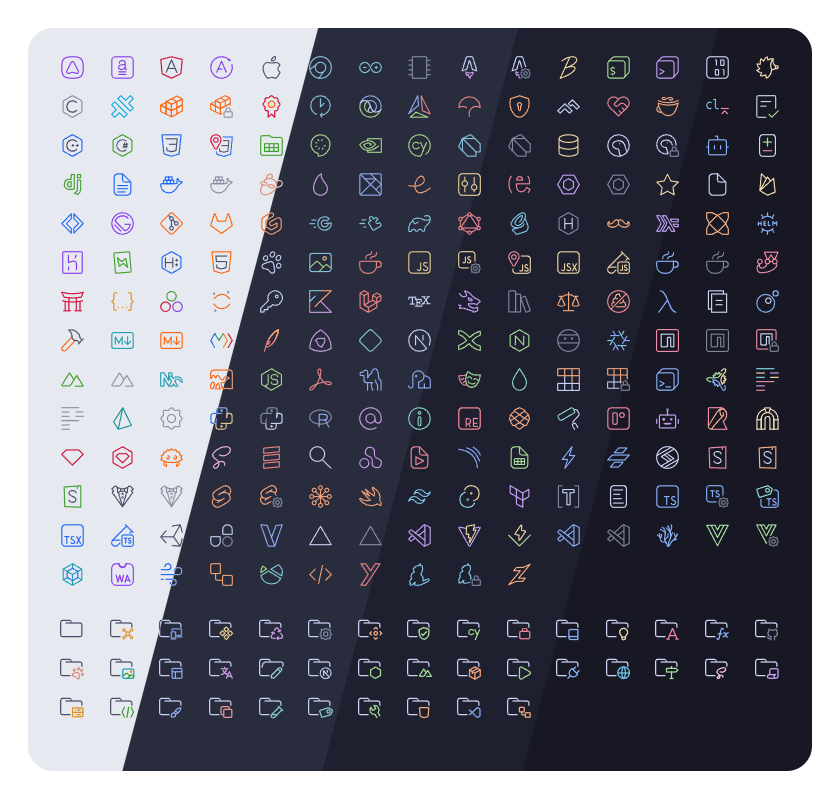
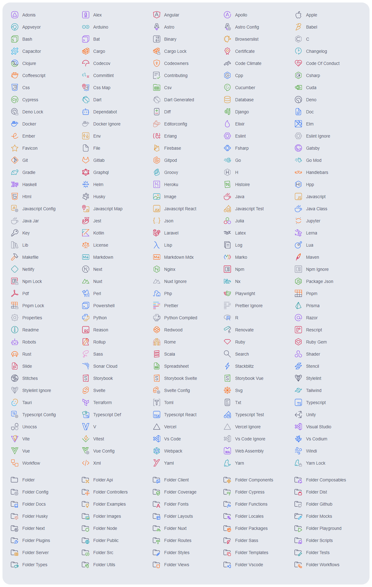
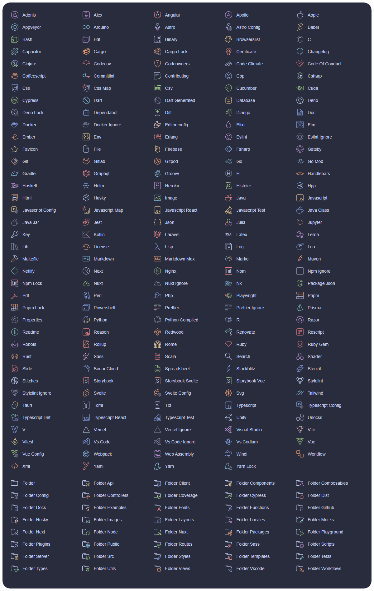
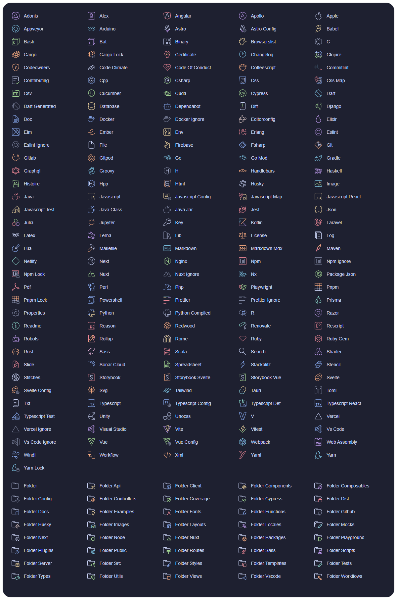
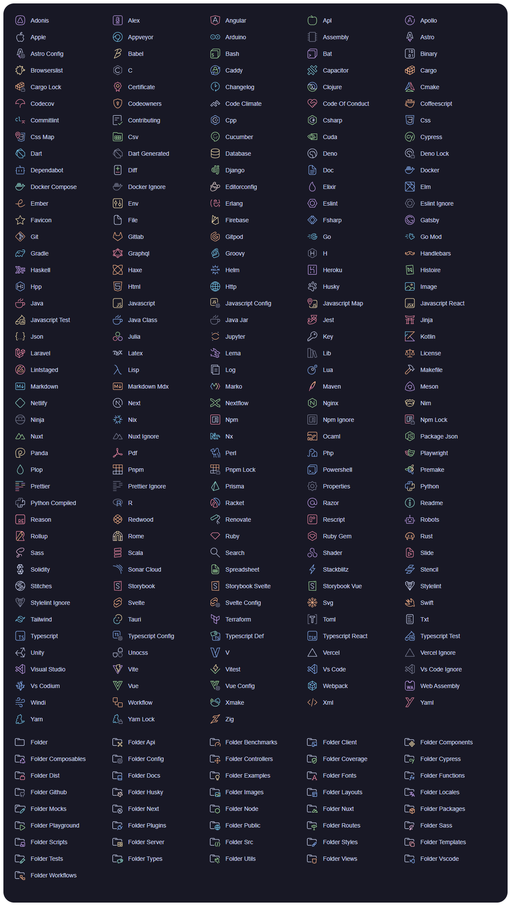

<h3 align="center">
	 
	
	Catppuccin icons for <a href="https://code.visualstudio.com/">VSCode</a>
	
</h3>

	
	
	

	

## Previews

🌻 Latte

🪴 Frappé

🌺 Macchiato

🌿 Mocha

## Usage

1. Install the [icon theme extension](https://marketplace.visualstudio.com/items?itemName=Catppuccin.catppuccin-vsc-icons)
2. Press <key>CTRL</key> + <key>Shift</key> + <key>P</key> or <key>CMD</key> + <key>Shift</key> + <key>P</key>
3. Type in `> File Icon Theme` and press enter
4. Select your flavor and press enter
5. Enjoy!

## 💝 Thanks to

- [PraZ](https://github.com/prazdevs)

&nbsp;

	

	Copyright &copy; 2021-present <a href="https://github.com/catppuccin" target="_blank">Catppuccin Org</a>

	

