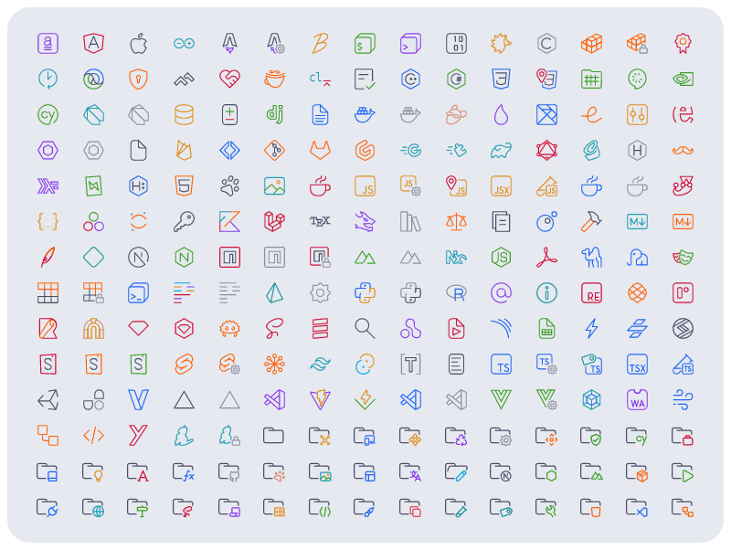
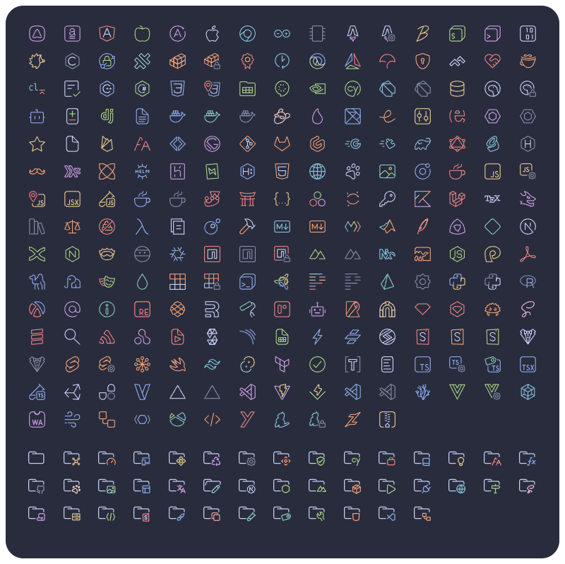
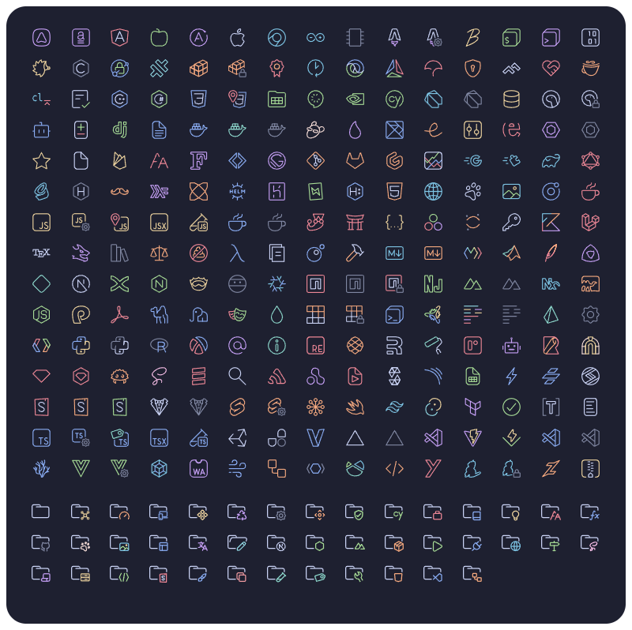
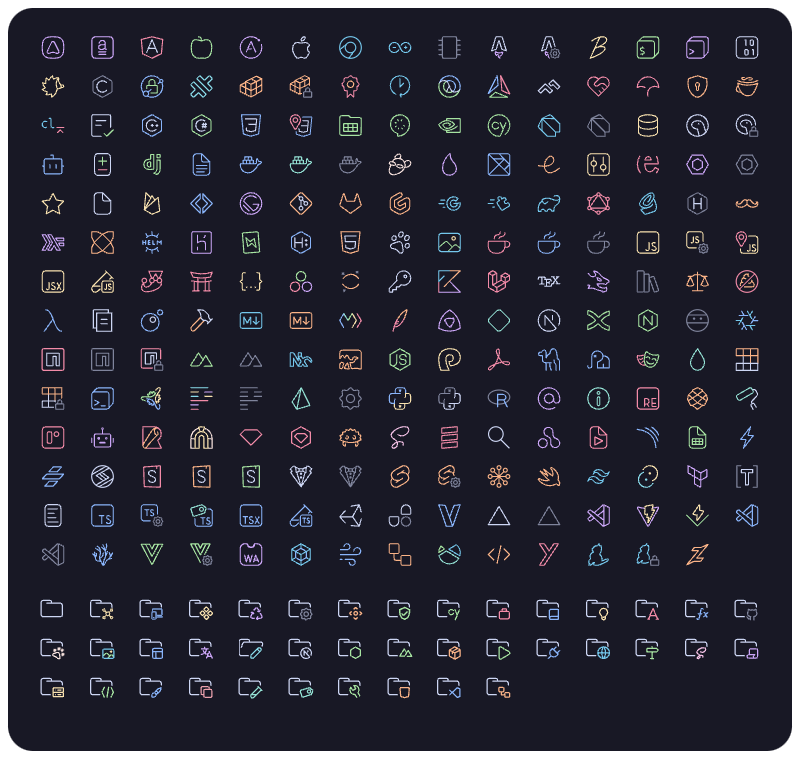

<h3 align="center">
	 
	
	Catppuccin perfect pixel icons for <a href="https://code.visualstudio.com/">VSCode</a>
	
</h3>

  

	<picture>
    <source srcset="assets/preview@2x.webp 2x">
    
  </picture>

## Previews

  
🌻 Latte

  <picture>
    <source srcset="assets/previews/latte-icons@2x.png 2x">
    
  </picture>

  
🪴 Frappé

  <picture>
    <source srcset="assets/previews/frappe-icons@2x.png 2x">
    
  </picture>

  
🌺 Macchiato

  <picture>
    <source srcset="assets/previews/macchiato-icons@2x.png 2x">
    
  </picture>

  
🌿 Mocha

  <picture>
    <source srcset="assets/previews/mocha-icons@2x.png 2x">
    
  </picture>

## Usage

1. Install the [icon theme extension](https://marketplace.visualstudio.com/items?itemName=thang-nm.catppuccin-perfect-icons)
2. Press <kbd>Ctrl</kbd>+<kbd>Shift</kbd>+<kbd>P</kbd> or <kbd>⌘</kbd>+<kbd>⇧</kbd>+<kbd>P</kbd>
3. Type in `> File Icon Theme` and press enter
4. Select your flavor and press enter
5. Enjoy!

&nbsp;

	

	Redesign by <a href="https://github.com/thang-nm" target="_blank">thang-nm</a>

