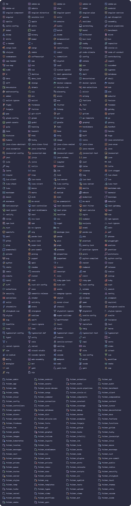
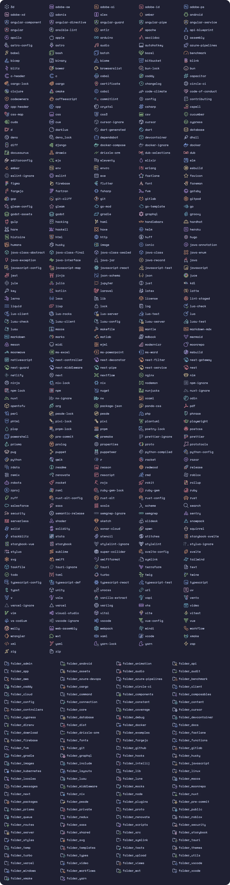
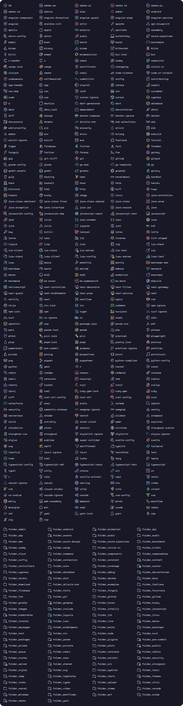

<h3 align="center">
  <br/>
  
  Catppuccin Icons for <a href="https://code.visualstudio.com/">VSCode</a>/<a href="https://vscodium.com/">VSCodium</a>
  
</h3>

<p align="center">
  <a href="https://github.com/catppuccin/vscode-icons/stargazers"></a>
  <a href="https://github.com/catppuccin/vscode-icons/issues"></a>
  <a href="https://github.com/catppuccin/vscode-icons/contributors"></a>
</p>

<p align="center">
  
</p>

## Previews

<details>
  <summary>🌻 Latte</summary>
  
</details>
<details>
  <summary>🪴 Frappé</summary>
  
</details>
<details>
  <summary>🌺 Macchiato</summary>
  
</details>
<details>
  <summary>🌿 Mocha</summary>
  
</details>

## Features

- Soothing colors from the Catppuccin palette.
- Ever growing collection of language/technology specific icons.
- Look and feel consistency.
- Custom associations, monochrome icons, and more!

## Usage

> [!TIP]
> We also have [a Catppuccin theme for the rest of VSCode/VSCodium](https://github.com/catppuccin/vscode), as well as [a Catppuccin theme that brings these icons right into file explorers on the web](https://github.com/catppuccin/web-file-explorer-icons). For Jetbrains IDEs we have [catppuccin/Jetbrains-icons](https://github.com/catppuccin/jetbrains-icons).

### Marketplace

Install the extension from one of the following marketplaces.

- [Visual Studio Marketplace](https://marketplace.visualstudio.com/items?itemName=Catppuccin.catppuccin-vsc-icons)
- [Open-VSX](https://open-vsx.org/extension/Catppuccin/catppuccin-vsc-icons)

### Manual

Download the VSIX from
[the latest GitHub release](https://github.com/catppuccin/vscode-icons/releases/latest).
Open the Command Palette and select "Extensions: Install from VSIX...", then select the file you just downloaded.

## Customization

### Settings

Defaults for each setting are shown below.

```jsonc
{
  // Set to `true` to disable folding arrows next to folder icons.
  "catppuccin-icons.hidesExplorerArrows": false,

  // Set to `false` to only use the default folder icon.
  "catppuccin-icons.specificFolders": true,

  // Set to `true` to only use the `text` fill color for all icons.
  "catppuccin-icons.monochrome": false
}
```

To see all available options, open your settings UI and look for `Extensions > Catppuccin Icons`.

> [!IMPORTANT]
> Changing settings regenerates/rewrites theme files and icons. It may take some time on lower-end computers. You may also be prompted to reload the window for changes to take effect.

### Custom icon associations

You can also associate specific `languagesIds`/`fileExtensions`/`fileNames`/`folderNames` to icons and override the provided defaults.

```jsonc
{
  // Files with the language type `typescriptreact` will have the `typescript-react` icon.
  "catppuccin-icons.associations.languages": {
    "typescriptreact": "typescript-react"
  },

  // Files with the `spec.ts` extension will have the `typescript-test` icon.
  "catppuccin-icons.associations.extensions": {
    "spec.ts": "typescript-test"
  },

  // Files with the name `vite.config.ts` will have the `vite` icon.
  "catppuccin-icons.associations.files": {
    "vite.config.ts": "vite"
  },

  // Folders with the name `typings/` will have the `folder_types` icon.
  "catppuccin-icons.associations.folders": {
    "typings": "folder_types"
  }
}
```

> [!NOTE]
> All available icons are listed in the [preview images above](#previews). Custom/external SVGs are not supported, though you may [request icons](#requesting-icons-and-features).

### Commands

We provide a set of commands to interact with the extension and icons if needed.

- `Catppuccin Icons: Factory reset settings`: removes all customization and resets the theme to the defaults.

## Requesting icons and features

To request a new icon or a specific feature, [open an issue](https://github.com/catppuccin/vscode-icons/issues/new/choose) documenting everything needed — the more information provided, the faster your request will be processed.

## Contributing

If you are willing to contribute new icons or features, refer to the [contribution guide](./CONTRIBUTING.md).

## 💝 Thanks to

- [PraZ](https://github.com/prazdevs)
- [thang-nm](https://github.com/thang-nm)

&nbsp;

<p align="center">
  
</p>

<p align="center">
  Copyright &copy; 2021-present <a href="https://github.com/catppuccin" target="_blank">Catppuccin Org</a>
</p>

<p align="center">
  <a href="https://github.com/catppuccin/catppuccin/blob/main/LICENSE">
    
  </a>
</p>
