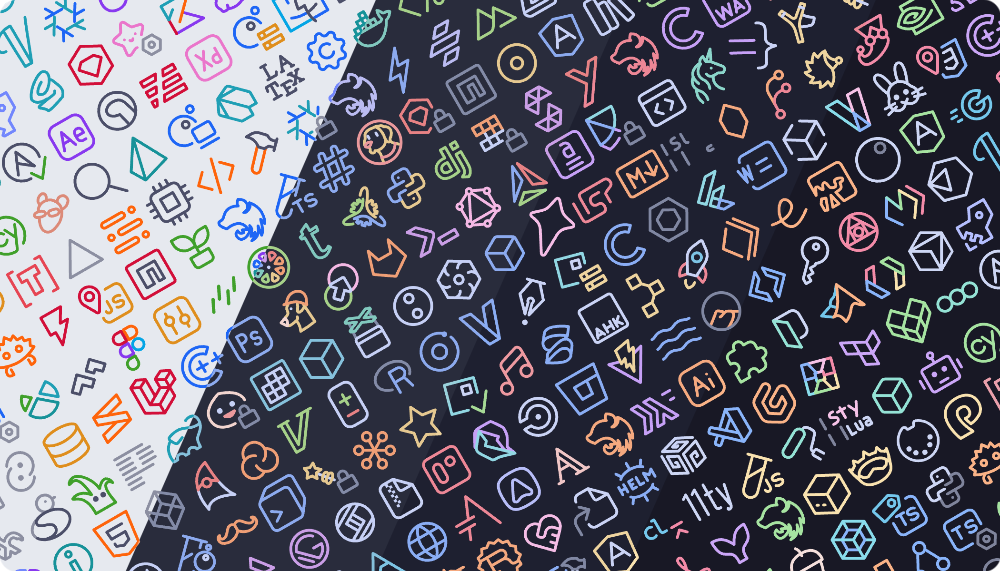

<h3 align="center">
   
  
  Catppuccin icons
  
</h3>

  
  
  

  

## Previews

  
🌻 Latte

  

  
🪴 Frappé

  

  
🌺 Macchiato

  

  
🌿 Mocha

  

## Features

- Soothing colors from the Catppuccin palette.
- Ever growing collection of language/technology specific icons.
- Look and feel consistency.
- Customization features (coming soon™).

## Usage

**Preferred method of installation**

Install the extension from a Marketplace:

- [Visual Studio Marketplace](https://marketplace.visualstudio.com/items?itemName=Catppuccin.catppuccin-vsc-icons)
- [Open-VSX](https://open-vsx.org/extension/Catppuccin/catppuccin-vsc-icons)

**Manual method for installation**

Download the VSIX from
[the latest GitHub release](https://github.com/catppuccin/vscode-icons/releases/latest).
Open the Command Palette and select "Extensions: Install from VSIX...", then open the file you just downloaded.

## Customization

> [!NOTE]
> We also have a [Catppuccin Theme](https://marketplace.visualstudio.com/items?itemName=Catppuccin.catppuccin-vsc)!

## Requesting icons and features

To request a new icon or a specific feature, [open an issue](https://github.com/catppuccin/vscode-icons/issues/new/choose) documenting everything needed, the more info the faster your request will be processed.

## Contributing

If you are willing to contribute, new icons or features, refer to the [contribution guide](./CONTRIBUTING.md).

## 💝 Thanks to

- [PraZ](https://github.com/prazdevs)

&nbsp;

  

  Copyright &copy; 2021-present <a href="https://github.com/catppuccin" target="_blank">Catppuccin Org</a>

  

